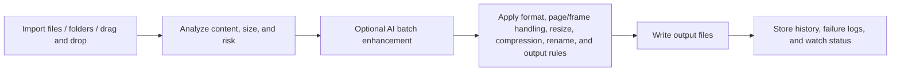

<p align="center">
  
</p>

<h1 align="center">Imvix Pro</h1>

<p align="center">
  A professional desktop conversion tool for batch workflows, local AI assistance, mixed document/image inputs, and Windows integration.
</p>

<p align="center">
  <a href="README.md">简体中文</a> | English
</p>

<p align="center">
  <a href="https://get.microsoft.com/installer/download/9p0nzsf11cs6?referrer=appbadge" target="_self" >
    
  </a>
</p>

<p align="center">
  .NET 10 | Avalonia 11 | MVVM | Local AI Runtime | PDF / PSD / GIF / OCR / QR / Barcode
</p>

> Imvix Pro is no longer just a simple “change the file extension” image converter. The current Pro build is closer to a desktop workstation for images, documents, icon assets, and automation workflows, with batch conversion, PDF and GIF expansion, PSD preview, offline AI features, intelligent preview tools, folder watch automation, and Windows integration.

## Overview

Imvix Pro is a Windows-first desktop conversion tool, and the current repository version is `2.0.1`.
`2.0.1` is a UI and copy synchronization update that mainly adds Vietnamese (`vi-VN`) and Thai (`th-TH`) support while aligning the version display, release notes, and multilingual documentation.
It combines format conversion, batch compression, resizing, intelligent analysis, PDF/PSD handling, offline AI tools, recent history, failure logs, and folder watch workflows in one desktop application.

Compared with the older standard-edition README, the current Pro build has clearly expanded into:

- mixed image, vector, PDF, PSD, EXE icon, and desktop shortcut icon intake
- first-class `PDF` output with page, range, and split strategies
- local offline AI batch enhancement plus preview-window AI enhancement, AI matting, and AI erasing
- OCR, QR recognition, barcode recognition, file-detail inspection, and Windows integration features
- reusable workflows through presets and saved folder-watch profiles

## Highlights

| Area | What the current Pro build provides |
| --- | --- |
| Mixed intake | Multi-file import, folder import, drag-and-drop, with support for PNG, JPG, JPEG, WEBP, BMP, GIF, TIFF, TIF, ICO, SVG, PDF, PSD, EXE, and LNK |
| Conversion output | PNG, JPEG, WEBP, BMP, GIF, TIFF, ICO, SVG, and PDF output with source-folder or custom-folder routing |
| Batch rules | Compression quality, resize strategies, rename rules, overwrite control, transparency handling, and ICO/SVG background settings |
| PDF / GIF workflows | PDF current-page, all-pages, page-range, and split-single-page export; GIF first-frame, specific-frame, and all-frame export |
| AI batch enhancement | Local offline AI image enhancement that runs before the regular conversion pipeline continues |
| Intelligent preview tools | Preview-window AI enhancement compare, AI matting, AI erasing, OCR text recognition, QR scanning, and barcode scanning |
| Workflow tools | Presets, pause/resume/cancel, recent history, failure logs, auto-open output folder, and saved folder-watch profiles |
| Windows integration | System tray support, run on startup, desktop shortcuts, and Windows “Open with Imvix Pro” context menu integration |
| UX and localization | 12 UI languages, light/dark/system theme modes, window placement restore, and PDF lock / unlock flow |

## Supported Scope

| Type | Scope |
| --- | --- |
| Batch import / open | PNG, JPG, JPEG, WEBP, BMP, GIF, TIFF, TIF, ICO, SVG, PDF, PSD, EXE, LNK |
| Batch output | PNG, JPEG, WEBP, BMP, GIF, TIFF, ICO, SVG, PDF |
| AI batch enhancement input | PNG, JPG, JPEG, WEBP, BMP, static TIFF, and single-frame GIF |
| Preview AI matting / erasing | Supported static raster images |
| Preview OCR / QR / barcode | Previewable image content, including rendered previews of PDF and PSD sources |

Notes:

- When a batch contains `PDF`, `PSD`, `SVG`, animated `GIF`, or other inputs that are not suitable for AI batch enhancement, those files skip AI enhancement and continue through the standard conversion path.
- `PDF` input can be exported as images or exported back out as `PDF`, with all-page, current-page, page-range, and split-single-page strategies.
- `GIF` input supports first-frame, specific-frame, and all-frame strategies. When the output format is not `GIF`, the app can expand frames into separate outputs.
- `EXE` and `LNK` inputs are primarily used as icon-extraction sources.

## AI and Intelligent Tools

### 1. AI batch image enhancement

- Fully local and offline
- Based on Real-ESRGAN and Upscayl model families
- Supports requested upscale targets from `2x` to `16x`
- Supports `Auto` and `Force CPU` execution modes
- Enhanced results continue through the existing compression, resize, output, and naming rules
- The UI explicitly marks third-party models that carry extra non-commercial notices

### 2. Preview-window AI tools

- `AI enhancement preview`: generate an enhanced preview for the current item, compare original/result/split view, and save the result
- `AI matting`: local ONNX background removal with `U2Net`, `ISNet`, `MODNet`, `AnimeSeg`, transparent output, or solid-color background output
- `AI eraser`: local `LaMa`-based erase-and-repair tool with brush size, mask expansion, and edge blend controls

Note: `AI matting` and `AI eraser` are currently preview tools only. They do not participate in batch conversion or folder-watch tasks.

### 3. Recognition and analysis

- `OCR text recognition`: offline Paddle OCR v5 runtime
- `QR scanning`: detect QR content and extract links
- `Barcode scanning`: detect common 1D and 2D barcodes
- `Content analysis`: format suggestions, transparency-risk warnings, compression-risk warnings, and output size estimation

## File and Document Handling

- `PDF`
  - first-page preview, page navigation, and page-range selection
  - export to images or export to new PDF files
  - password unlock flow and locked-file skip behavior
- `PSD`
  - import and rendered composite preview
  - PSD canvas, layer, channel, and color detail inspection
- `EXE / LNK`
  - extract application icons or shortcut icons as conversion sources
- `File detail viewer`
  - inspect image, PDF, PSD, EXE, and LNK metadata and derived information

## Workflow and Integration

- Presets: save, apply, overwrite, and delete conversion presets
- History: record recent conversions, trigger source, duration, estimated size, and output summary
- Logging: generate failure logs only when a task contains failed items
- Folder watch: save the current rules as a watch profile and process new files automatically
- System tray: keep the app available after closing the main window
- Run on startup: use a Windows startup shortcut
- Explorer context menu: show “Open with Imvix Pro” for supported image, PDF, PSD, EXE, and LNK files

## Processing Flow



## Current Architecture

```text
Imvix Pro/
|-- Assets/Localization/         # 12 language resources
|-- RuntimeAssets/AI/            # AI enhancement, matting, erasing models and runtimes
|-- RuntimeAssets/Ocr/           # OCR runtime assets
|-- RuntimeAssets/Qr/            # QR runtime configuration
|-- RuntimeAssets/Barcode/       # barcode runtime configuration
|-- Services/AI/                 # AI enhancement, matting, and erasing services
|-- Services/ImageConversion/    # core conversion, encoding, saving, and format handling
|-- Services/PdfModule/          # PDF import, render, security, and export
|-- Services/PsdModule/          # PSD import, render, and detail analysis
|-- ViewModels/Main/             # main window state, AI, PDF, preview, and watch logic
|-- Views/                       # main UI, preview window, detail window, dialogs, and summaries
`-- Imvix Pro.csproj             # main desktop project
```

## Build and Run

### Requirements

- Windows is the primary validated and published target for this repository
- `.NET 10 SDK`
- A desktop environment supported by Avalonia

### Run locally

```bash
dotnet restore
dotnet build "Imvix Pro.csproj"
dotnet run --project "Imvix Pro.csproj"
```

### Publish a Windows single-file build

```bash
dotnet publish "Imvix Pro.csproj" -c Release -r win-x64 --self-contained true /p:PublishSingleFile=true
```

Additional notes:

- The UI uses Avalonia, but the published target and integration layer are clearly Windows-focused in the current repository.
- OCR, EXE/LNK icon handling, run-on-startup, Explorer context menus, some codec paths, and some AI acceleration paths are Windows-dependent.

### Recommended Runtime Environment for the current `win-x64` release

| Item | Recommendation |
| --- | --- |
| Release architecture | The current package is intended for `win-x64` only |
| Operating system | Use `Windows 10 22H2 x64 (Build 19045)` as the minimum baseline, or a newer `Windows 11 x64` release. For new devices or new deployments, `Windows 11 x64` is preferred. Additional note: `Windows 10 22H2` reached Microsoft's end of support on `2025-10-14` |
| CPU | `4 cores / 8 threads` on an x64 processor is a practical starting point for batch conversion, PDF/PSD preview, and OCR/QR/barcode workflows. For smoother large-batch work, `6 cores / 12 threads` or better is recommended, such as Intel Core i5 10th Gen / AMD Ryzen 5 3600-class CPUs or newer |
| Memory | `8 GB` works for lighter tasks; `16 GB` is the more suitable baseline for the current Pro build; `32 GB` is recommended if you regularly handle large PDF/PSD jobs or keep AI preview tools active |
| GPU | A discrete GPU is not required for standard conversion, preview, OCR, QR, barcode, or Windows integration. For smoother `AI Batch Image Enhancement`, use a GPU that supports both `DirectX 12` and `Vulkan`, with `4 GB` VRAM as a practical floor and `6 GB+` preferred, such as GTX 1650 / RTX 2050, RX 6400 / 6500 XT, Arc A380, or newer |

Additional assessment:

- The repository targets `.NET 10`, and both the project file and publish setup are already narrowed to `win-x64`, so `Windows 10 22H2 x64` is the most appropriate minimum recommendation for the current release line.
- `AI Batch Image Enhancement` uses the bundled `realesrgan-ncnn-vulkan.exe`, so it is best suited to systems with a Vulkan-capable GPU. CPU-only machines are better matched to the standard conversion pipeline, or to AI features with noticeably slower performance.
- `AI Matting` tries DirectML first and automatically falls back to CPU when DirectML is unavailable, so it can still run without a discrete GPU, but usually with a clear speed penalty.
- These recommendations are aimed at smooth all-around use of the current Pro build, not only the lightest single-image conversion scenario.

## Configuration and Data

On Windows, Imvix Pro stores app data under `%AppData%\Imvix Pro`.

| File or folder | Purpose |
| --- | --- |
| `settings.json` | Language, theme, default output rules, presets, watch configuration, preview-tool settings, and window state |
| `history.json` | Recent conversion history |
| `Logs/conversion-*.log` | Batch failure logs |

If an older `%AppData%\Imvix` folder exists, the application attempts to migrate it to `%AppData%\Imvix Pro`.

## Localization

Built-in UI resources are available for the following 12 languages (with `vi-VN` and `th-TH` added in `2.0.1`):

- `zh-CN`
- `zh-TW`
- `en-US`
- `ja-JP`
- `ko-KR`
- `fr-FR`
- `de-DE`
- `it-IT`
- `ru-RU`
- `ar-SA`
- `vi-VN`
- `th-TH`

`ar-SA` uses right-to-left layout support.

## Tech Stack

- `.NET 10`
- `Avalonia UI 11`
- `CommunityToolkit.Mvvm`
- `SkiaSharp`
- `Docnet.Core`
- `Magick.NET`
- `Microsoft.ML.OnnxRuntime` / `DirectML`
- `RapidOCR.Net`
- `ZXing.Net`

## License and Commercial Use

This repository ships with a custom source-available license in [`LICENSE`](LICENSE).

- The author / copyright holder retains the right to use, license, sell, distribute, and operate Imvix Pro commercially
- Any other individual or organization must contact the author and obtain prior written permission before using the project in a commercial product, paid service, revenue-generating workflow, internal business operation, or any other commercial scenario
- Current commercial licensing contact email: `339106817@qq.com`
- Because commercial use is restricted, this project is `source-available`, not an OSI-approved open source project
- Bundled third-party runtimes, models, or assets may have their own license terms, and you must still comply with them
